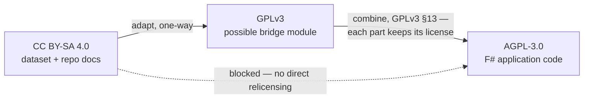

# Licensing — how CC BY-SA data and AGPL code fit together

*Written 2026-07-02, when the code license was decided (AGPL-3.0) alongside the already-pinned
CC BY-SA 4.0 for data and docs. This explains why the two must stay separate artifacts and
exactly which interactions are safe. Standard CC/FSF community reading — not legal advice.*

## The pieces

| Artifact | License |
|---|---|
| Published dataset + this repo's docs | CC BY-SA 4.0 (see [LICENSE](../LICENSE)) |
| F# application code (future, own tree) | AGPL-3.0 (own LICENSE file when it lands) |
| Ingested share-alike sources (toh.json, wi-cat) | CC BY-SA 4.0 / 3.0 (3.0→4.0 is one-way) |

Full tier table: [architecture.md → Licensing tiers](architecture.md#licensing-tiers).

## The compatibility map

## Why there is no direct path

Both licenses are copyleft: each insists that derivative works stay under itself.

- CC BY-SA 4.0's ShareAlike clause allows adaptations to be distributed only under BY-SA 4.0
  itself or a license Creative Commons has **officially declared compatible**. That list
  (<https://creativecommons.org/compatiblelicenses>) contains exactly two entries: the Free
  Art License 1.3 and **GPLv3**. AGPL-3.0 is not on it.
- AGPL-3.0 requires the whole program, as conveyed, to be licensable under AGPL.
- AGPL is textually "GPLv3 plus the network-use clause", but compatibility declarations are
  read literally — a different license is a different license.

Neither license permits sublicensing under the other, so a work that is simultaneously an
adaptation of BY-SA material and part of an AGPL program cannot be distributed coherently.

## What "folding in" means (the failure modes)

The conflict arises only when BY-SA material becomes *part of the program* — a derivative or
combined work. Concretely, for this project, all of these would do it:

- compiling seed data derived from toh.json or wi-cat into the F# binary as a baked-in table;
- copying WikiDevi/wiki prose into string literals, resources, or doc comments;
- embedding BY-SA-derived test fixtures directly in source files.

## What is always fine

Everything the architecture actually does falls in one of these three safe categories:

1. **Runtime processing.** The AGPL app reading the CC BY-SA dataset, the SQLite projection,
   or toh.json at runtime creates no derivative in either direction. Code that processes data
   is not an adaptation of the data; data processed by a program does not inherit the
   program's license.
2. **Mere aggregation.** Shipping code and data side by side — same repo, same release, same
   container — is explicitly exempted by the GPL family ("mere aggregation on a distribution
   medium"), and BY-SA has the equivalent concept (a collection is not an adaptation). What
   matters is clear per-artifact license labeling.
3. **Facts-only extraction.** Individual facts are uncopyrightable (*Feist v. Rural*, US), so
   extracting "this board has 2.5GbE" into our own schema is unencumbered regardless of where
   it was read. Share-alike bites on substantial, structured extractions — a wholesale mirror
   of toh.json stays a CC BY-SA 4.0 *data* artifact and never migrates into code. (In the EU
   the sui generis database right adds a separate substantial-extraction test; see
   [research doc 07](research/2026-07-02/07-gaps-and-risks.md), gap 1.)

## The two-hop footnote (why the rule still says "never")

A legal route technically exists, in two hops: adapt BY-SA 4.0 material to **GPLv3** (the
one-way compatibility above), then combine the GPLv3 module with the AGPL work under the
mirror clauses GPLv3 §13 / AGPL-3.0 §13, each part keeping its own license. It is not used
here because:

- it is one-way — material that goes BY-SA → GPLv3 can never return to BY-SA;
- it creates a permanent mixed-license lattice with per-part obligations;
- whether "data compiled into a module" is the kind of work §13 contemplates is untested;
- the project ethos is simple and personal-scale.

So the working invariant, recorded in [architecture.md](architecture.md): **data and code stay
separate artifacts with separate licenses; BY-SA material is never folded into the code tree.**

## Attribution obligations

The published dataset must ship a NOTICE/ATTRIBUTION file naming each ingested source and its
license — BuildCores OpenDB (ODC-By 1.0) from the first published record onward, OpenWrt ToH
(CC BY-SA 4.0) and wikidevi.wi-cat.ru (CC BY-SA 3.0, adapted under 4.0) once router data
lands. Details in [architecture.md → Licensing tiers](architecture.md#licensing-tiers).

---

*This document, like the rest of the repo's prose, is CC BY-SA 4.0 — copy freely within the
license.*
